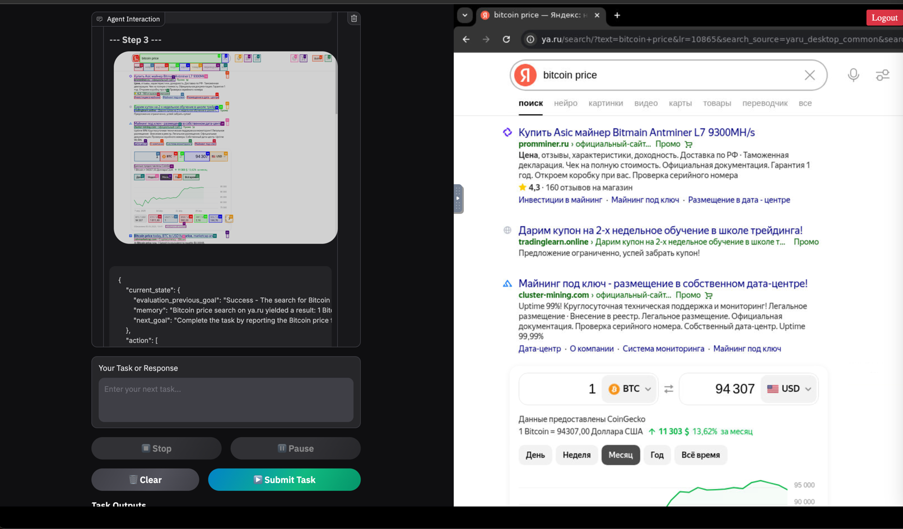
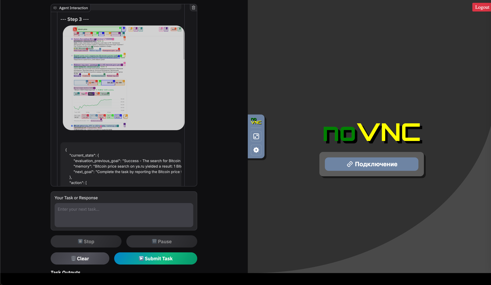

<br/>

# Улучшенный веб-интерфейс для Browser Agent

#ФОРК ОФФ РЕПО https://github.com/browser-use/web-ui

## Скриншоты интерфейса

<div align="center">

<p><em>Веб-интерфейс с разделенным экраном: слева Gradio, справа - браузер через VNC</em></p>


<p><em>Подключение к VNC для управления браузером</em></p>
</div>

[](https://github.com/browser-use/web-ui/stargazers)
[](https://link.browser-use.com/discord)
[](https://docs.browser-use.com)
[](https://x.com/warmshao)

## Что нового?

Я значительно улучшил стабильность и функциональность веб-интерфейса:

- **Единый интерфейс**: Объединенный доступ к Gradio и VNC в одном окне браузера
- **Защищенный доступ**: Авторизация по логину и паролю для контроля доступа
- **Разделенный экран**: Фиксированное разделение экрана 50/50 для комфортной работы
- **Прямая интеграция**: Прямой доступ к браузеру через VNC для полного контроля
- **Стабильная работа**: Оптимизированный код, обеспечивающий надежное взаимодействие с браузером

## Быстрый старт с Docker Compose

Самый простой способ запуска - использование Docker Compose:

```bash
# Клонируем репозиторий
git clone https://github.com/browser-use/web-ui.git
cd web-ui-split-display

# Запускаем через Docker Compose
docker-compose up -d
```

После запуска:
- Веб-интерфейс доступен по адресу: http://localhost:9220
- Логин: `admin` (можно изменить через ADMIN_USERNAME)
- Пароль: `password` (можно изменить через ADMIN_PASSWORD)

## Подробная информация

Веб-интерфейс разделен на две части:
- **Левая панель**: Интерфейс Gradio для взаимодействия с агентом (порт 7788)
- **Правая панель**: VNC-доступ к браузеру Chrome (порт 6080)

### Настройка через переменные окружения

```bash
# Настройки авторизации
ADMIN_USERNAME=admin          # Имя пользователя для входа
ADMIN_PASSWORD=password       # Пароль для входа

# Настройки VNC
VNC_PASSWORD=vncpassword      # Пароль для VNC-доступа
```

---

# Enhanced Web Interface for Browser Agent

## What's New?

We have significantly improved the stability and functionality of the web interface:

- **Unified Interface**: Combined access to Gradio and VNC in a single browser window
- **Secure Access**: Login and password authentication to control access
- **Split Screen**: Fixed 50/50 screen division for comfortable work
- **Direct Integration**: Direct access to the browser through VNC for complete control
- **Stable Operation**: Optimized code ensuring reliable browser interaction

## Quick Start with Docker Compose

The easiest way to launch is using Docker Compose:

```bash
# Clone the repository
git clone https://github.com/browser-use/web-ui.git
cd web-ui-split-display

# Launch with Docker Compose
docker-compose up -d
```

After launch:
- Web interface is available at: http://localhost:9220
- Login: `admin` (can be changed via ADMIN_USERNAME)
- Password: `password` (can be changed via ADMIN_PASSWORD)

## Detailed Information

The web interface is divided into two parts:
- **Left panel**: Gradio interface for interacting with the agent (port 7788)
- **Right panel**: VNC access to the Chrome browser (port 6080)

### Configuration via Environment Variables

```bash
# Authentication settings
ADMIN_USERNAME=admin          # Login username
ADMIN_PASSWORD=password       # Login password

# VNC settings
VNC_PASSWORD=vncpassword      # Password for VNC access
```

## Additional Features

**WebUI:** Built on Gradio, supports most of `browser-use` functionalities. Designed to be user-friendly for easy interaction with the browser agent.

**Expanded LLM Support:** Integrated support for various Large Language Models (LLMs), including: Google, OpenAI, Azure OpenAI, Anthropic, DeepSeek, Ollama and more.

**Custom Browser Support:** You can use your own browser with our tool, eliminating the need to re-login to sites or deal with authentication challenges.

**Persistent Browser Sessions:** You can keep the browser window open between AI tasks, allowing you to see the complete history and state of AI interactions.

## Advanced Configuration

### Docker Environment Variables

```bash
# LLM API Keys
OPENAI_API_KEY=your_key_here
ANTHROPIC_API_KEY=your_key_here
GOOGLE_API_KEY=your_key_here

# Browser Settings
CHROME_PERSISTENT_SESSION=true   # Keep browser open between AI tasks
RESOLUTION=1920x1080x24          # Custom resolution
VNC_PASSWORD=your_vnc_password   # Password for VNC access
```

## Changelog
- [x] **New**: Added stable web interface with split screen and login protection
- [x] **New**: Fixed 50/50 screen layout with direct VNC browser integration
- [x] **New**: Simplified Docker Compose deployment
- [x] **2025/01/26:** Thanks to @vvincent1234. Now browser-use-webui can combine with DeepSeek-r1 to engage in deep thinking!
- [x] **2025/01/10:** Thanks to @casistack. Added Docker Setup option and support for keeping browser open between tasks.
- [x] **2025/01/06:** Thanks to @richard-devbot. A New and Well-Designed WebUI was released.
